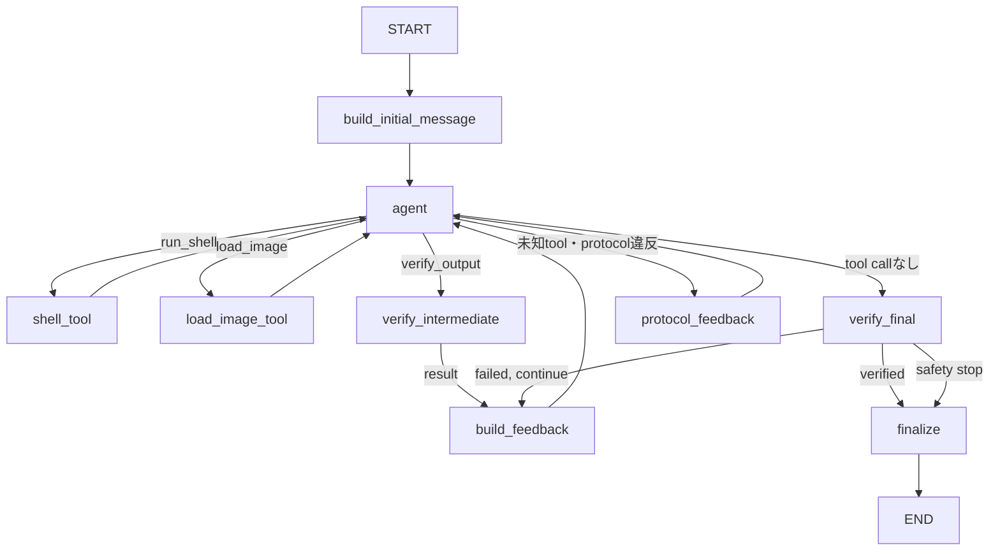

# Zero-shot Pipeline 再実装計画（Final）

## 1. シニアレビュー結論

Claude版の`zeroshot_dep/pipeline/`は、責務別のフォルダ分けには再利用価値がある。一方、今回の第一目的である「実装者自身が内部ロジックを理解し、将来一人で変更できること」に対して、元の実装計画は妥当ではない。

特に、次の点を修正する。

- 巨大な`run_zero_shot.py`を先に多数のファイルへ切り出さない
- CLI agent用sandbox、credential、provider監査をAPI版へ一括移植しない
- DrawingIR、pose推定、仮説fan-outを、動くbaselineより先に実装しない
- LangGraphのgraphだけ先に大きく作り、stub nodeを後から埋める方式を採らない
- 入力、実行、feedback、評価を一度に実装しない
- 推論中の自己検証と、GTを使うオフライン評価を混同しない
- projection IoUや閾値を、十分なcalibrationなしに候補の自動棄却へ使わない
- 比較実験用budgetを、将来の並列agent構成が未定の段階でgraphへ埋め込まない

新実装では、最小のend-to-end経路を最初に完成させ、その後に一機能ずつ追加する。各追加機能は、単体テスト、少数サンプルでの観察、アブレーションの順で評価する。

`zeroshot_dep/`はコピー元や完成形ではなく、次の用途に限定する。

- 入出力contractの確認
- security、CAD実行、監査で考慮すべき失敗例の収集
- DrawingIR、pose、projectionの研究仮説の参照
- 新実装との回帰比較

## 2. 目的と優先順位

優先順位は以下とする。

1. 実装者が各moduleの目的、入出力、失敗条件、テスト方法を説明できる
2. 一サンプルの全message、tool call、artifact、状態遷移を再現・監査できる
3. 評価の誤りやGT leakageがないことを保証する
4. zero-shot 3D CAD復元精度を、測定可能な変更によって改善する
5. 将来、並列agent、Gemini/Claude CLI backend、追加の図面解析を導入できる

精度向上は最終目標だが、「機能を増やしたから改善したはず」とは判断しない。必ず、同一サンプル、同一モデル条件による比較結果を残す。

## 3. 確定した設計要件

### 3.1 Package名

正式名称は次に統一する。

```text
zeroshot/
zeroshot_dep/
```

新実装の内部ロジックは`zeroshot.pipeline`として通常のPython packageにする。ユーザー向けCLIだけは`zeroshot/run_pipeline.py`に置く。`zero-shot`表記、`sys.path`への場当たり的な追加、ハイフン付きpackageのimport workaroundは新実装へ持ち込まない。

実行方法は最終的に次へ統一する。

```bash
python -m zeroshot.run_pipeline ...
```

### 3.2 一サンプルの入力

正式な入力は以下の4点とする。

```text
techdraw/dxf/<id>.dxf
render_3d/hlg_perspective/<id>.png
render_3d/hlg_translucent_faces_perspective/<id>.png
render_3d/transparent_shaded_edges_perspective/<id>.png
```

3枚のPNGは三方向のviewではなく、同じ部品を異なる表現styleで描いた3種類のperspective renderである。

`target/`または`target_step/`は、独立したオフライン評価processだけが読む。推論graph、model、tool、feedback生成processからは到達不能にする。

### 3.3 初回入力のaccess config

```yaml
access_render3d: image           # none | path | image
access_render3d_styles:
  - hlg_perspective
  - hlg_translucent_faces_perspective
  - transparent_shaded_edges_perspective
```

意味は以下の通り。

- DXFは必須入力として、`InputManifest`が持つinput DXF pathと役割を常に初回user messageへ入れる
- `access_render3d: none`: 初回は3D renderを与えない
- `access_render3d: path`: 選択styleのpathとstyle名だけを伝える
- `access_render3d: image`: 選択styleの画像をmultimodal user messageへ添付する

`access_dxf` configは設けない。raw DXF textまたはDXF JSON tagsをmessageへ直接注入せず、modelが必要に応じてDXF解析toolを使う。

### 3.4 次ターンのfeedback config

```yaml
feedback_render3d: image         # none | path | image
feedback_render3d_styles:
  - hlg_perspective
  - hlg_translucent_faces_perspective
  - transparent_shaded_edges_perspective
```

意味は以下の通り。

- verified STEPからfeedback DXFを生成できた場合、そのpathを次のfeedback user messageへ常に入れる
- `feedback_render3d: none`: 候補の3D renderを返さない
- `feedback_render3d: path`: 選択styleのpathだけを返す
- `feedback_render3d: image`: 選択styleの画像を次のmultimodal feedback user messageへ添付する

`access_render3d_styles`と`feedback_render3d_styles`は独立させる。初回入力とfeedbackで異なるstyle集合を使えるようにし、別々にアブレーションする。

`feedback_dxf` configは設けない。DXF feedback機能が実装された後はpathを常に返す。ただしsyntax error、timeout、invalid STEP、projection failureなど、DXFが存在しない場合は架空のpathを返さず、生成不能理由をexecution feedbackへ含める。

`FeedbackManifest.render3d_paths`には生成に成功したstyleのキーとpathだけを入れ、失敗したstyleのキーを入れない。valueへ`None`を入れない。MessageBuilderは存在するstyleだけを返し、0枚ならrender用content block自体を追加しない。欠損理由は必須のexecution feedbackへ含める。

`feedback_execution`を無効化するconfigは設けない。実行成否、syntax/AST error、timeout、STEP生成、solid数、kernel validityなど、信頼済み実行器が得た結果は必ずmessage historyと監査logへ残す。runが継続する場合は必ず次のmodel turnへ返す。

### 3.5 Modelとbackend

初期対象は以下とする。

- SGLang serverでserveするQwen3.6
- GPT API

LangGraphはworkflowを実行し、実際のmodel API呼び出しはLangChainのchat model integrationが担当する。QwenはSGLangのOpenAI-compatible endpointへ接続し、GPTはOpenAI endpointへ接続する。

workflowはprovider名、base URL、credentialへ依存させない。API版では`model.bind_tools()`が生成したtool-call可能なmodelをagent nodeへ注入する。

将来、Gemini/Claudeを非APIのCLI経路で追加する。その際は、CLI outputをLangGraphが扱う`AIMessage`とtool callへ正規化するadapterを別実装する。CLI固有のcredential、filesystem jail、native tool、provider trace監査を、初期API版へ先回りして入れない。

### 3.6 Agent数とbudget

初期版は単一agentとする。仮説fan-out、候補ごとの並列agent、投票、branch mergeは実装しない。

将来の並列化に備え、初期版から以下のIDを持つ。

- `run_id`
- `sample_id`
- `agent_id`
- `verification_id`
- tool call ID
- artifact IDと所有verification

比較実験用の`max_model_turns`、`max_verifications`などは初期graphへ固定実装しない。並列構成が決まった後、graphから独立した`BudgetPolicy`として設計する。

ただし、運用上の安全装置として以下は初期版から必要である。

- model API timeout
- CAD実行timeout
- OCC render timeout
- 高めで変更可能なLangGraph再帰安全上限
- 外部からのrun cancellation
- 安全停止理由の監査記録

## 4. Architecture

### 4.1 信頼境界

処理を次の4領域へ分ける。

| 領域 | 役割 | GT access |
|---|---|---|
| Agent workflow | message、tool選択、`model.py`編集、検証要求 | 禁止 |
| Persistent sandbox workdir | model生成shell/Pythonによる入力解析、数値計算、CAD試行 | 禁止 |
| Trusted reconstruction runtime | sandbox起動、verification登録、STEP検証、feedback生成 | 禁止 |
| Offline evaluator | 完了した予測STEPとGT STEPの比較 | 許可 |

model生成commandとcodeはすべてuntrustedとする。通常のprocessで直接実行せず、共通の`SandboxRunner`からtool callごとにfreshなtimeout可能隔離processを起動する。Linuxの`bwrap --unshare-all`を必須の隔離境界とし、`bwrap`が見つからない場合は`SandboxRunner`の構築を失敗させ、非隔離subprocessへfallbackしない。実行時にsandbox processを起動できない場合は`INFRA_ERROR`としてfail closedにする。

sampleごと・agentごとに一つの`SandboxWorkdir`を作り、run終了まで保持する。`SandboxWorkdir`は、内部生成した一時`host_bind_dir`を所有するmodeと、trusted callerから渡された既存directoryを借用するmodeを持つ。どちらのmodeでもsandbox側のbind先は`/work`である。`run_shell`と`verify_output`はtool callごとにfreshなbwrap processを起動するが、毎回同じ`SandboxWorkdir`をread-writeでbindする。これによりprocess、Python変数、環境変数は共有しない一方、modelが作成・編集した`model.py`、解析script、JSON、dump画像などの中間fileはtool call間で保持する。

### 4.2 Pathと生成artifactの扱い

`InputManifest`はhost側の通常の`Path`で必須のinput DXFとinput render mappingを保持する。`FeedbackManifest`はverification ID、必須のexecution feedback、optionalなfeedback DXFとfeedback render mappingを保持する。original inputとverification feedbackは寿命と生成元が異なるため、一つのcombined manifestへまとめない。style名の固定listをpipeline内へ重複定義せず、`InputManifest.render3d_paths`のkey集合をそのsampleで利用可能なstyleのsource of truthとする。`target/`と`target_step/`はいずれのmanifestにも含めない。

`SandboxWorkdir`作成後、trusted callerが`Path`と`shutil`を使い、active sampleのDXFとconfigで許可されたinput renderだけを`host_bind_dir`配下の固定pathへcopyする。この初期copyをstagingと呼ぶ。`SandboxWorkdir`と`SandboxRunner`はmanifest、file配置、staging policyを知らない。専用の`Workspace` class、`WorkspacePath`、host/sandbox pathの再帰変換API、`copy_in`/`copy_out` wrapperも作らない。host側の元fileをmountしないため、workdir内のcopyをmodelが変更しても元fileには影響しない。`verify_output`がfeedback DXFとperspective viewsを生成した後は、trusted callerがそのverificationの生成物を同じworkdirへ追加する。GT、repository、他sample、未許可render、credentialはstageしない。

modelへは`host_bind_dir`を教えず、`/work`配下のsandbox pathのみを提示する。`run_shell`のcwdは常に`/work`である。manifestはtrusted host fileの存在検証とmessage用画像読取に使い、modelへ提示するpath文字列はstaging時に決めたpathを使う。`load_image`は`host_bind_dir`配下の画像だけを読み、path traversalとworkdir外を指すsymlinkを拒否する。入力DXFは正規の問題入力なので`model.py`や解析scriptから自由に読み取れる。一方、GT、repository、他sample、credential、networkはどのmodel生成commandからも到達不能にする。

workdir内fileはmodelが自由に変更できるscratchであり、それだけではtrusted artifactとしない。`verify_output`ごとに現在の`model.py`をhash付きimmutable artifactとして保存し、verified STEPと対応するDXF/renderを同じverification IDへ紐付ける。複数領域で共通の登録・hash・manifest処理が実際に重複した時点で`ArtifactStore`を抽出する。

### 4.3 依存方向

依存は次の一方向にする。

```text
run_pipeline
  -> workflow
       -> models
       -> tools
            -> inputs
            -> sandbox
            -> verification
                 -> src.data.render
  -> audit

offline evaluation
  -> src.evaluation
  -> src.metrics
```

`workflow`から`zeroshot/run_zero_shot.py`または`zeroshot_dep`をimportしない。

## 5. 目標フォルダ構成

最初から空ファイルをすべて作らず、後述のphaseで必要になった時点で追加する。

```text
zeroshot/
├── __init__.py
├── run_zero_shot.py                 # 既存CLI baseline。再実装中は変更しない
├── run_pipeline.py                  # 後続: 新pipelineの薄いHydra composition root
├── pipeline/
│   ├── __init__.py
│   ├── manifest.py                  # InputManifest / FeedbackManifestとpath検証
│   ├── messages.py                  # access/feedback message builder
│   ├── runner.py                    # 後続: application wiringとsample loop
│   ├── sandbox.py                   # SandboxWorkdirと全model生成command用の共通隔離実行基盤
│   ├── models/
│   │   ├── __init__.py
│   │   ├── base.py                  # normalized AgentModel protocol
│   │   ├── api.py                   # GPT / SGLang OpenAI-compatible
│   │   └── cli.py                   # 後続: Gemini / Claude CLI
│   ├── tools/
│   │   ├── __init__.py
│   │   ├── run_shell.py
│   │   ├── load_image.py
│   │   └── verify_output_tool.py
│   ├── verification/
│   │   ├── __init__.py
│   │   ├── run_cadquery.py         # CadQuery実行、STEP生成・検証
│   │   ├── verify_output.py        # source保存とCadQuery実行の固定順序
│   │   └── render.py               # Phase 5: 三面図DXF・perspective views生成
│   ├── workflow/
│   │   ├── __init__.py
│   │   ├── state.py
│   │   ├── agent.py
│   │   ├── routing.py
│   │   └── graph.py
│   ├── audit/
│   │   ├── __init__.py
│   │   ├── events.py
│   │   └── writer.py
│   ├── evaluation/
│   │   ├── __init__.py
│   │   └── score_run.py
│   ├── drawing/                     # 後続TODO
│   │   ├── schema.py
│   │   ├── extract.py
│   │   ├── summary.py
│   │   └── pose.py
└── configs/
    ├── default.yaml
    └── model/                       # Phase 4で追加
        ├── gpt.yaml
        └── qwen_sglang.yaml

tests/
└── zeroshot/
    ├── fixtures/
    ├── test_hydra_config.py
    ├── test_manifest.py
    ├── test_messages.py
    ├── test_verification.py
    ├── test_sandbox.py
    ├── test_tools.py
    ├── test_graph.py
    ├── test_feedback.py
    └── test_leakage.py
```

`run_pipeline.py`はHydraによるconfig composition、依存objectの生成、内部pipelineの呼び出しだけを担当し、sample loopやworkflow構築を置かない。Phase 1では`zeroshot/configs/default.yaml`と、`pipeline/`直下の`manifest.py`、`messages.py`だけを追加する。`run_pipeline.py`と`runner.py`を含む後続ファイルは必要になるphaseまで作らない。

設定専用の`config.py`は作らない。YAMLの`_target_`と各runtime classのconstructorをcontractにし、`hydra.utils.instantiate()`で生成する。未知の引数や不足した必須引数はinstantiate時に拒否し、値の許容範囲や組合せのようなsemantic validationは、その値を所有するclass自身が行う。

ファイルが大きくなってから責務に沿って分割する。最初から`constants.py`、`provider.py`、`credentials.py`などを機械的に量産しない。

## 6. LangGraph Agent設計

### 6.1 State

`messages`にはLangGraphの`add_messages` reducerを使う。それ以外は単一agentが一箇所ずつ更新し、未使用の並列reducerを先回りして入れない。

概念上のstateは以下とする。

```python
class ReconstructionState(TypedDict, total=False):
    messages: Annotated[list[BaseMessage], add_messages]

    run_id: str
    sample_id: str
    agent_id: str

    access_config: dict
    feedback_config: dict

    verification_ids: list[str]
    last_verification: dict | None
    final_verification_id: str | None

    artifact_manifest_path: str
    audit_path: str
    status: str
    safety_stop_reason: str | None
```

`SandboxWorkdir`、`SandboxRunner`、renderer、model objectなどのruntime dependencyはstateへ入れない。長いstdout/stderr、画像bytes、`model.py`本文、render画像もstateへ直接蓄積しない。stateにはmessage history、verification ID、最後の構造化結果、検証済みfilesystem pathまたは保存済みartifact IDを保持する。

### 6.2 bindするtool

初期agentへ次の3toolを公開する。

1. `run_shell(command)`
2. `load_image(path)`
3. `verify_output()`

`run_shell`はmodelが生成した任意のbash commandを、run中共有する`SandboxWorkdir`をbindしたsandbox内で実行する。modelに公開するtool引数は`command`だけとし、timeoutはtrusted側の`SandboxRunner`設定を使う。`SandboxRunner`と`SandboxWorkdir`はtool factoryのclosureで保持する。tool resultは`SandboxResult`を`status`、`returncode`、`stdout`、`stderr`からなるJSON化可能なmappingへ変換し、non-zero exit、`TIMEOUT`、`INFRA_ERROR`もtool自体の未処理例外にせず結果として返す。modelはshell、Python、標準commandを使ってworkdir内のfileを自由に読み書きし、`model.py`、解析script、JSON、dump画像をtool call間で継続利用できる。sandboxには`ezdxf`、Pillow、NumPyと、現在対応しているCAD libraryを用意する。初期vertical sliceではCadQueryを対象とする。workdir以外のhost filesystem、GT、repository、credential、networkへ到達させない。

`load_image`はworkdir pathを受け取り、workdir外へのescapeとsymlinkを拒否した上で画像をmultimodal contentとしてmodelへ返す。これによりmodelはinput/feedback renderだけでなく、自ら生成したdump画像も確認できる。

modelへ公開する`verify_output` toolは引数を取らず、共有`SandboxWorkdir` rootの`model.py`だけを対象とする。toolから呼ぶtrusted側の関数は`render_views: bool = False`を受け取る。`verification/verify_output.py`は現在のsourceをimmutable artifactへ保存し、同じ`SandboxWorkdir`を`run_cadquery.py`へ渡してtrusted export epilogue付きwrapperをfreshなbwrap process内で実行し、STEP再読込、single solid、kernel validityを確認する。

Phase 3/4では`render_views=False`だけを使い、`True`なら明示的に`NotImplementedError`を送出する。この例外はmodel reconstruction failureではなく、未実装機能を有効にしたconfiguration errorとしてrun開始前またはtrusted runtime境界で扱う。Phase 5で`True`を実装し、verifiedの場合だけ`render.py`で三面図DXFとperspective viewsを生成してverification ID配下のartifactとworkdir内feedbackへ保存する。

Phase 2の`SandboxRunner`が提供するresource guardはwall timeoutと返却するstdout/stderrの切り詰めまでである。`capture_output=True`によるprocess実行中のbuffer量、CPU、memory、PID数、workdirのdisk使用量のhard limitはまだ提供しない。固定fixtureとfake modelだけを扱うPhase 2/3ではこの範囲とし、実model生成commandを動かすPhase 4のlive smoke test前に、bounded log captureとcgroupまたは同等機構によるresource limitを追加する。

system promptには「workdir内の`model.py`へ最終CadQuery Solidを`result`変数として保存する」「shellで自由に解析・試行できる」「必要な時に`verify_output`を呼べる」「完成したらtool callなしで応答する」を記述する。利用可能package、workdirのpath、tool result contractはtool descriptionへ記述し、ezdxfやCadQueryの個別API tutorialをsystem promptへ埋め込まない。

### 6.3 中間実行と最終実行

同じ`verification.verify_output()`を次の2経路から使う。

1. modelが`verify_output` toolを自発的に呼ぶ中間検証
2. modelがtool callなしで完成を表明した後、workflowが呼ぶ最終検証

最終検証では、中間検証済みで`model.py`のhashが同じでも再実行する。これによりworkdirに残った古いSTEPではなく、現在の`model.py`と対応するSTEPであることを保証する。監査eventには呼び出し元を`model`または`workflow`として記録する。

model主導の`verify_output`は対応する`ToolMessage`でtool protocolを閉じる。中間検証後は`build_feedback` nodeがexecutionとSTEP verificationを含む`HumanMessage`を追加してagentへ戻す。Phase 5でvisual feedbackを実装した後はDXF/render pathもここへ加える。最終検証はtool callに対応しないworkflow actionなので、成功時はそのまま終了し、修正可能な失敗時だけfeedback `HumanMessage`を追加してagentへ戻す。

- 成功: verified STEPをfinal artifactに昇格し、そのmodelを再呼び出さず終了する
- source、execution、STEP、renderの修正可能な失敗: feedbackを返してagentへ戻す
- safety stop: 未検証成果物を成功扱いせず、理由を保存して終了する

### 6.4 Graph topology

`create_react_agent`で隠蔽せず、学習のため`StateGraph`とconditional edgeを明示的に組み立てる。3toolは遷移先と副作用が異なるため、一つの汎用`ToolNode`へまとめず専用nodeで実行する。



tool callを生成するかはmodelが決める。tool callの引数検証、実行、次nodeへのroutingはworkflowが決める。

### 6.5 Image tool resultの互換性

初回の`image` modeは通常のmultimodal user messageとして送る。

`load_image`では、tool call IDに対応する`ToolMessage`を必ず作る。その上で画像content blockを同じToolMessageで扱えるか、GPT backendとSGLang/Qwen backendのlive capability testを行う。

両backendで同じ形式が使えない場合は、全backendで次へ統一する。

1. `ToolMessage`でartifact ID、style、読取成功を返す
2. 続くuser messageへ画像を添付する

providerごとに異なる会話意味論を使うのではなく、両者がサポートする共通形式を採用する。

Phase 5で`feedback_render3d: image`を実装する際は、`verify_output`のToolMessageへ直接混ぜず、対応するToolMessageの後に`build_feedback` nodeが作るmultimodal user messageへ添付する。これによりtool protocolと「feedbackを次のuser instructionで返す」という実験条件を分離する。modelが自発的に生成したdump画像はPhase 3から`load_image`で個別に確認できる。

## 7. 監査設計

LangGraphを採用する主目的の一つは、agentの外部から観測可能な行動を監査することである。

各runで少なくとも次を保存する。

- run/sample/agent/verification ID
- graph nodeと遷移元・遷移先
- provider、model、base URL識別子、sampling parameter
- access/feedback configとeffective style
- Hydraでresolveした実効config
- system/user/tool messageの再現に必要なpayloadまたはartifact参照
- prompt template versionとrendered prompt hash
- tool名、検証済み引数、tool call ID
- toolの呼び出し元`model | workflow`
- 開始・終了時刻、duration、status、短いerror
- verification時の`model.py` hash
- execution、STEP verification、render結果
- token usageなどproviderが返すusage
- safety stopとinfra error

監査対象はmessage、tool call、tool result、artifact、状態遷移である。非公開chain-of-thoughtの生成や保存を要求しない。

LangGraphのcheckpointerだけを唯一の研究記録にしない。人間が読みやすくversionに依存しにくい`events.jsonl`と`artifact_manifest.json`をcanonical recordにする。checkpointerはresumeやdebugの補助として扱う。

credential、API key、authorization headerは保存しない。base URLにsecret queryが含まれる場合もredactする。

## 8. 実装フェーズ

各phaseは前のphaseの成果を実際に読み、テストし、説明できてから進む。

### ✅ Phase 0: datasetと既存評価器の基準線を確認する

#### 確認するもの

- 新package名を`zeroshot`に確定する
- `data/test_vlm/test_vlm.csv`に記載された20件すべてを、固定debug兼regression sampleとする
- 既存testにある手書きDXF、画像、CadQuery code、STEP fixtureを再利用できることを確認する
- `src.evaluation`、`src.metrics`、solid検査の既存testを実行し、評価基準線とする

詳細contractは全体像が見えない段階で一括固定しない。各phaseの実装直前に、そのphaseが必要とする最小の入出力だけをtestと型で確定する。`zeroshot/run_zero_shot.py`と`zeroshot_dep`は、その時点で必要な振る舞いを調べる参照資料とし、先にcontractを転記しない。

API agent用dependencyのversion固定もこのphaseでは行わない。GPTとQwen/SGLangの最初のlive vertical sliceが動いたPhase 4で、実際に検証できた組合せを記録する。

#### 評価器のsanity check

- GT STEPを自身と比較した場合に高得点になる
- missing predictionは成功率の分母から消えず、失敗として数えられる
- invalid STEP、multi-solid、timeoutがrun全体を落とさない
- 明らかに異なる形状または変形形状でscoreが低下する
- shape-normalized metricとunnormalized metricを混同しない

#### 理解チェック

次を自分の言葉で説明できること。

- 推論中のfeedbackとGT評価の違い
- なぜ図面から絶対scaleが復元できない場合があるか
- なぜOCC処理をchild processへ隔離するか

#### 完了条件

modelもLangGraphも呼ばず、20件の入力集合が揃っていることと、既存fixtureに対する評価器の正否を確認できる。

#### 完了記録

2026-07-27に`drawing2cad` conda environmentで、次の既存testを実行した。

- `tests/evaluation/test_evaluator.py`
- `tests/evaluation/test_scoring.py`
- `tests/metrics/test_eccv.py`
- `tests/metrics/test_geometry.py`
- `tests/data/audit/test_solid_checks.py`

結果は39 test passed、40 subtests passed。`data/test_vlm`は20 IDすべてについてDXF、3種類のrender、GT STEPのID集合が一致したため、Phase 0を完了とする。

### ✅ Phase 1: Hydra component config、入力、message builder

#### 実装するもの

- `zeroshot/configs/default.yaml`
- `manifest.py`
- `messages.py`
- 対応するunit test

#### 順序

1. `InputManifest`を実装し、必須input DXFとinput render mappingを保持する。全pathの存在とDXFの拡張子を検証し、render画像の拡張子は固定しない
2. `FeedbackManifest`を別に実装し、verification ID、必須execution feedback、optional feedback DXFとfeedback render mappingを保持する
3. 選択されたinput/feedback render bytesをそれぞれのmanifestから必要時に読めるようにする
4. `InputManifest`を受け取り、DXF pathを常に含め、render access configをconstructor引数に持つmessage builderで初回messageを構築する
5. `FeedbackManifest`を受け取り、存在するDXF/render feedbackだけを返すfeedback構築methodを作る
6. `default.yaml`からmessage builderを`hydra.utils.instantiate()`できることをtestする
7. 全config組合せをtable-driven testにする

dataset全体のsample列挙はPhase 1で抽象化しない。Phase 3でsample loopが必要になった時点で、まず`runner.py`内の短い処理として実装し、複数箇所から必要になるか複雑になった場合だけ関数またはclassへ抽出する。

`InputManifest`と`FeedbackManifest`は通常のfilesystem pathを持つ独立したimmutable snapshotとする。original inputはsample単位、feedbackはverification単位であり、ID、必須field、生成時期が異なるため一つのmanifestへ統合しない。独自のlogical path DTOや汎用`dto/`packageは作らない。生成artifactの管理抽象と配置も、具体的な重複が現れるまで延期する。

`DEFAULT_SYSTEM_PROMPT`と、renderの`none | path | image`およびfeedback種別に応じて追加する文言は`messages.py`に置く。現段階では別の`prompts.py`やHydra prompt configへ分割しない。system promptにはsampleに依存しない役割、出力contract、必要時にtoolを利用できることだけを簡潔に置き、具体的なtool名とschemaは各tool descriptionに置く。sample固有pathと選択されたmodalityの説明は`HumanMessage`側で組み立てる。`none`でも「提供されている場合はperspective renderを併用する」という条件付き一般文はsystem promptへ残してよい。

render styleの固定listを`src.data.render.config`からimportせず、pipeline内にも重複定義しない。MessageBuilderは選択されたaccess/feedback styleが`InputManifest.render3d_paths`のキーに含まれることを検証する。これにより現在の3 styleを固定せず、manifestへ追加された将来の画像styleへ対応する。`FeedbackManifest.render3d_paths`はその部分集合を許可する。

#### 必須test

- DXF pathが全ての初回messageに現れ、raw DXF textは現れない
- renderの`none`では個別のrender style、path、画像payloadがHumanMessageに現れない
- renderの`path`では`InputManifest`のpathとstyle名だけが現れる
- `image`では選択された画像だけが宣言順に添付される
- 複数画像は各style名のtext blockと対応するimage blockの順に並ぶ
- access styleとfeedback styleが混ざらない
- manifestのinput render keyにない選択styleと重複styleを拒否する
- feedback renderが3/2/1枚なら存在するstyleだけを返し、0枚ならrender blockを追加しない
- feedback mappingのvalueへ`None`を許可しない

#### 完了条件

modelとCADを使わず、Hydraからcomponentを生成し、全message payloadをtestで目視・比較できる。

#### 完了記録

2026-07-28にPhase 1を完了した。

- `InputManifest`と`FeedbackManifest`を分離し、それぞれのpathを検証してrender mappingをimmutableなsnapshotとして保持する
- `MessageBuilder`で初回入力とexecution/DXF/render feedbackを構築し、access/feedbackのmodeとstyleを独立に検証する
- render styleの固定listを設けず、各sampleのinput render mappingを利用可能styleのsource of truthとする
- Hydraの`ListConfig`をconstructor内でtupleへ正規化し、`default.yaml`から`MessageBuilder`を生成できる
- `tests/zeroshot`は42 test passed
- `ruff check`と`ruff format --check`はPhase 1対象の全fileで通過した

### ✅ Phase 2: Trusted CAD execution

#### 最初の対象

まずCadQueryだけでvertical sliceを完成させる。`cad_format`をcontractには含めるが、build123d対応はCadQuery executorの理解とtest完了後に同じinterfaceへ追加する。

#### 実装するもの

- AST/source validation
- trusted executorが実行ごとにUUIDのexecution IDを発番し、immutable sourceを保存
- owned/borrowedの両modeを持つ`SandboxWorkdir`
- kill可能な隔離subprocess
- `output.step`生成contract
- STEP再読込
- single solidとkernel validityの検証
- `CadQueryExecutionReport`

#### 重要方針

- model codeをpipeline process内で`exec`しない
- 後続の`run_shell`と`verify_output`内部のCadQuery実行が再利用する共通`SandboxRunner`をここで実装する
- `SandboxRunner`はLinuxの`bwrap --unshare-all`を必須とし、利用不能時に非隔離subprocessへfallbackしない
- `CadQueryExecutor`の`artifact_root`はtrusted runtimeだけが読書きする永続artifact置き場であり、sandboxの一時work directoryとして公開またはmountしない
- `SandboxRunner.run(command, workdir: SandboxWorkdir, timeout_s)`は`workdir.host_bind_dir`だけをread-writeの`workdir.sandbox_bind_dir`（初期値`/work`）として公開し、host pathのstaging方針を持たない
- trusted callerは`SandboxWorkdir.host_bind_dir`を通常の`Path`として直接操作する。file stagingやartifact回収のためだけのwrapper methodは追加しない
- `host_bind_dir=None`なら`SandboxWorkdir`が一時directoryを所有してcontext終了時に削除し、既存directoryを渡した場合は借用して削除しない
- Python専用runnerにはせず、`command`はsandbox内の`bash -c`へ渡す。Pythonおよびその子processは同じfilesystem/network境界に閉じ込める
- AST validationはPython構文だけを確認し、import allowlistを設けない。利用可能moduleとfilesystem accessはsandbox viewで制御する
- 固定fixtureを対象とするPhase 2ではsample入力をstageしない。active DXFと許可済みrender/feedbackのstagingは、具体的なtool contractを実装するPhase 3で追加する
- GT、repository、他sample、未許可render、credentialをsandboxへ渡さない
- wall timeout時はbwrap processをkillし、`--die-with-parent`で子processを残さない
- validation失敗とinfra failureを区別する
- 既存runnerのsecurity testを、コードではなくfixture/期待結果として参照する
- STEP検証は再import後のsingle solidとCadQuery/OpenCascadeの`isValid()`をPhase 2の最小条件とする。free edge検査やmesh watertightness監査は必要性を評価して後続で追加する
- sandboxが生成した`output.step`は、symlinkでない通常fileであることとSTEP validityをtrusted側で確認してからartifact directoryへcopyする。検証前の`shutil.copyfile()`でsandbox生成symlinkをhost側から辿らない

#### 必須test

- valid single box
- syntax error
- sandbox外fileを指定した動的importが失敗する
- filesystem探索で許可外入力、GT、repositoryへ到達できない
- host networkへ到達できない
- 子processを起動してもsandbox外filesystemへ到達できない
- owned workdirの削除、borrowed workdirの存続、同じworkdirを使う複数process間のfile永続性
- sandbox生成`output.step`がworkdir外を指すsymlinkなら拒否する
- STEP未生成
- zero solid / multi-solid
- invalid STEP
- infinite loop timeout
- 同じexecution artifactの上書き拒否

#### 完了条件

固定code fixtureだけを用い、安全に`CadQueryExecutionReport`とverified STEPを生成できる。

2026-07-30にPhase 2を完了した。

- `SandboxRunner`は`bwrap`でhost filesystemとnetworkを隔離し、fresh process、wall timeout、stdout/stderrの返却時切り詰めを提供する
- `SandboxWorkdir`は内部所有する一時directoryとcallerから借用する既存directoryの両方を、sandbox側の`/work`へ対応付ける
- `CadQueryExecutor`は元sourceをexecution ID配下へ保存し、sandbox用sourceにtrusted export epilogueを追加して`result`を`output.step`へexportする
- sandbox生成STEPはsymlink検査を含めtrusted側で再importし、single solidとkernel validityを確認したものだけを永続artifactへcopyする
- subprocess failure、timeout、sandbox infrastructure failureを別statusで返す
- `CadQueryExecutionReport`はsandbox内processのstdout/stderrを加工せず保持し、trusted executor側のvalidation/verification errorは`executor_error`へ分離する
- 実bwrapを用いるCadQuery boxのend-to-end testとsandbox生成symlinkの回帰testを含め、Sandbox/CadQuery対象は36 test passed
- `tests/zeroshot`全体は90 test passed
- `ruff check`と`ruff format --check`はPhase 2対象fileで通過した

### Phase 3: Fake modelによるLangGraph vertical slice

#### 実装するもの

- `tools/run_shell.py`
- `tools/load_image.py`
- `tools/verify_output_tool.py`
- `verification/run_cadquery.py`
- `verification/verify_output.py`
- `workflow/state.py`
- `workflow/agent.py`
- `workflow/routing.py`
- `workflow/graph.py`
- `pipeline/runner.py`
- `zeroshot/run_pipeline.py`を薄いHydra composition rootとして実装
- 最小監査writer
- scripted fake chat model

Phase 2の`execution/run_code.py`は`verification/run_cadquery.py`へ移動する。`CadQueryExecutionReport`、source validation、STEP validationの責務は維持するが、実行時に内部で一時`SandboxWorkdir`を作るPhase 2 contractから、callerがrun中共有する`SandboxWorkdir`を渡すcontractへ変更する。現在の`model.py`が同じworkdir内の補助moduleや入力fileを参照できる状態で、元の`model.py`を変更せずtrusted export処理を加えて実行する。sourceとverified STEPはverification ID配下へimmutable artifactとして保存する。

`verification/verify_output.py`は、source保存とこの低水準処理を固定順序で呼ぶuse caseであり、LangGraph tool固有の型へ依存させない。`tools/verify_output_tool.py`はtool callをこのuse caseへ接続する薄いadapterにする。

#### 作る順序

1. sample/agent用の`SandboxWorkdir`を一度作り、trusted callerがactive DXFと許可されたinput renderを`host_bind_dir`配下の固定pathへstageする
2. `SandboxRunner`と共有`SandboxWorkdir`をclosureに保持し、modelへ`command`だけを公開する`run_shell` toolを実装する
3. fake modelが`run_shell`で解析fileを作り、次の`run_shell`から同じfileを読めることを確認する
4. fake modelがworkdir rootへ`result`を定義した`model.py`を保存する
5. fake modelがtool callなしで完成を表明し、workflowが`verify_output(render_views=False)`で最終検証する
6. verified STEP、対応する`model.py`、監査logを保存し、feedback loopなしの直線経路を完成させる
7. fake modelが中間で`verify_output` toolを呼ぶ経路を追加する
8. execution/STEP verification feedbackを受けて`model.py`を修正し、再度最終検証するloopを追加する
9. `load_image`でinput画像またはmodel自身のdump画像を確認する経路を追加する

`SandboxWorkdir`はtool callごとに作り直さない。processだけを毎回freshにし、同じ`host_bind_dir`を`/work`へbindする。stagingはworkdir作成直後の一度だけ行い、それ以降はmodelが作った中間fileをrun終了まで保持する。Phase 5でvisual feedbackを追加した後は、そのfileも同じworkdirへ蓄積する。host側の元fileやmanifestのsource pathをsandboxへ直接公開せず、`SandboxRunner`へstaging責務も追加しない。staging処理が一箇所にしかない間はapplication wiring内の短い`Path`/`shutil`操作として書き、専用classへ抽出しない。

Phase 3ではvisual feedbackを実装しない。trusted側のverification関数は将来の拡張点として`render_views: bool = False`を持つが、`True`は`NotImplementedError`とする。LangGraph tool schemaにはこのflagを公開せず、Phase 3のtool wrapperとworkflowはいずれも必ず`False`で呼ぶ。最初に直線経路を通してから中間検証loopを足すことで、graph/routingの問題とrendererの問題を分離する。

#### 必須test

- tool call IDとToolMessage IDが一致する
- `run_shell`のtool schemaが`command`だけを公開し、runtime dependencyをmodelへ公開しない
- `run_shell`がbash、Python、workdir内fileのread/writeを行える
- 別々の`run_shell` callから同じ中間fileを読み書きできる
- workdir内のinput copyを変更してもhost側の元fileへ影響しない
- `access_render3d: none`または未選択styleのrenderをworkdirから読めない
- `run_shell`と`verify_output`からGT、repository、他sample、networkへ到達できない
- `run_shell`のtimeoutと出力上限がrun全体を落とさない
- `load_image`がworkdir内画像だけを返し、path traversalとsymlink escapeを拒否する
- `run_shell`が生成したscratch fileをverified artifactへ自動昇格しない
- `verify_output`が共有workdir rootの`model.py`だけを読み、source hash付きimmutable artifactを作る
- `verify_output(render_views=False)`がverified STEPを生成する
- `verify_output(render_views=True)`が`NotImplementedError`を送出する
- 最初のfake model scenarioがfeedback loopなしの直線経路で完了する
- model主導の中間検証後にfeedbackを追加してagentへ戻る
- tool callなしresponseの後にworkflowが最終検証を再実行する
- 最終検証失敗後にfeedbackを返してagentへ戻る
- safety stopで未検証STEPを成功扱いしない
- graph図が設計図と一致する
- eventsを順番に再生するとrunを説明できる

#### 完了条件

外部APIとvisual feedbackなしで、`SandboxWorkdir`への入力staging、複数回のshell作業、`model.py`の作成、workflow主導の最終検証、verified STEP保存までの直線経路を通す。その後、同じPhase内でmodel主導の中間検証とtext feedbackによる修正loopまで通す。

### Phase 4: GPT APIとQwen/SGLangを接続する

#### 実装するもの

- normalized `AgentModel` boundary
- GPT model factory
- SGLang OpenAI-compatible model factory
- `configs/model/gpt.yaml`と`configs/model/qwen_sglang.yaml`
- credential redaction
- bounded log captureとCPU/memory/PID数のresource limit
- backend capability smoke test
- one-sample live CLI

SGLang serverはpipelineと別process、可能なら別environmentで起動する。pipeline側は`base_url`、`model`、認証情報だけを受け取り、`sglang[all]`へ直接依存しない。

#### capability test

各backendで以下を実測する。

- `bind_tools()`したschemaを認識する
- structured tool argumentsを返す
- `run_shell`へcommandを渡し結果を利用できる
- 複数turnにわたるshell/image/verification tool callを扱える
- multimodal initial user messageを扱える
- imageを含むtool resultの共通形式を扱える
- token usage、finish reason、tool call IDを取得できる

#### live smoke test

最初は1 sample、1 model、CadQueryで実行する。成功率を論じる段階ではなく、workdirの変更、message、tool call、verification、state遷移を一行ずつ追う。

#### 完了条件

GPTとQwenの双方で、少なくともDXF解析、workdir内file編集、画像参照、中間検証、toolなし完成表明、workflow主導の最終検証が同じgraph上で動く。

このlive smoke testで動作したagent側とSGLang server側のdependency versionをそれぞれ記録し、以後の再現可能な基準とする。

### Phase 5: Feedback modeとrenderer calibration

Phase 3/4で未実装としていた`verify_output(render_views=True)`をここで実装する。LangGraphの遷移は変えず、verified STEPに対するvisual feedback生成と提示方法を追加する。

#### 実装順

1. `verification/render.py`を追加し、verified STEPから三面図DXFとperspective viewsを生成する
2. `verify_output(render_views=True)`から、STEP検証成功時だけrendererを呼ぶ
3. 生成成功時、三面図DXF pathをfeedback user messageへ常に入れる
4. workdirから元DXFと各verificationのfeedback DXFを参照できるようにする
5. `feedback_render3d: none`
6. `feedback_render3d: path`
7. `feedback_render3d: image`
8. style選択、部分失敗、message形式の組合せtest
9. identical STEP再renderと既知形状fixtureでrendererの再現性を測る

renderer本体は再実装せず、trusted側から以下を呼ぶ。

- `src.data.render.techdraw.generate_techdraw`
- `src.data.render.render3d.generate_render3d`
- `src.data.render.config`のpath/style contract

これらは同期処理なので、kill可能なchild processとtimeoutを設ける。CadQuery実行またはSTEP検証に失敗した場合はrenderしない。renderだけ失敗した場合は、実行・STEP検証の成功とrender failureを別statusで返す。

初期版では、再投影DXFの自動IoU閾値によるverification失敗判定を行わない。まずartifactをmodelへ返し、精度向上効果を測る。数値projection checkは後続の独立機能とする。

#### 必須test

- verified STEPとprojection成功時にfeedback DXF pathを必ず返す
- STEP未生成またはinvalid STEPではDXF/renderを生成しない
- DXF pathだけではraw DXF内容を自動注入しない
- workdirが元DXFと同じagentのverification feedbackだけを参照できる
- `image`で選択styleだけを添付する
- render生成が部分失敗した場合は成功したstyleだけを返し、0枚ならrender blockを作らない
- input画像とverification feedback画像を取り違えない
- renderer timeoutをexecution failureと混同しない
- feedback artifactがverification directory外へ出ない

#### 完了条件

必須DXF feedbackとrender access/feedbackの全modeが、fake modelと両live backendで意図したmessageになる。

### Phase 6: 評価と段階的アブレーション

#### 推論と評価の分離

推論runを完了・closeした後、別CLIでGT評価する。

```bash
python -m zeroshot.pipeline.evaluation.score_run \
  --run-dir <run_dir> \
  --target-dir <target_dir>
```

evaluatorは`src.evaluation.scoring`と`src.metrics`をimportして使い、metric実装をコピーしない。

#### 最初に報告する指標

- prediction coverage
- code execution success
- valid single-solid率
- normalized Voxel IoU
- normalized ECCV surface/edge/vertex/topology F1
- BoundingBox error
- unnormalized metricは参考値として別欄
- model call数、token、CAD実行数、wall time

自己feedbackで使う再投影DXFやrenderは、GT metricではない。自己整合性が高くても正しい3D形状とは限らないため、別欄に分ける。

#### データ運用

- debug set: 実装確認用の少数固定ID
- locked evaluation set: promptや閾値調整に使わない固定ID
- failed/missing predictionを集計から落とさない
- infra errorとmodel reconstruction failureを分ける
- sample ID list、model、sampling、config、code versionをrun manifestへ保存する

#### アブレーション順

全configの直積を最初から回さない。次の順で原因を分離する。

1. render access modality: `none/path/image`
2. access render style
3. render feedback: `none/path/image`
4. feedback render style
5. DrawingIRなし/あり

比較は可能な限り同一sampleのpaired resultで行う。小規模runでは平均値だけで結論を出さず、sample別の改善・悪化とfailure classを読む。

#### 完了条件

少なくとも一つの変更について、「どのsampleで、どのmetricが、どのcost増加とともに変化したか」を説明できる。

### Phase 7: DrawingIRを理解してから追加する

DrawingIRは削除対象ではなく、重要な将来の精度改善候補である。ただし既存codeを一括コピーしない。

#### `drawing/extract.py`

確認する内容:

- DXF entity typeとanalytic geometryへの変換
- layerからのfront/top/right view割当
- hidden linetype解決
- loop抽出
- view間correspondence
- degenerate entityの扱い

小さなDXF fixtureを一種類ずつ追加し、期待するIRを手で確認する。

#### `drawing/summary.py`

確認する内容:

- 何をpromptへ残し、何を省略するか
- hidden lineが存在しない図面の表現
- truncationによって重要featureが落ちないか
- 同じIRから常に同じsummaryを作れるか

golden testでsummary全文をreview可能にする。

#### `drawing/pose.py`

確認する内容:

- front/top/rightとworld axisの対応
- right-handed mapping
- 対称形状や同一extent軸による複数解
- scale/translation/rotationの責務
- 最初のmappingを無条件採用しないこと

cube、直方体、軸対称形状、非対称形状をfixtureにする。

#### 導入方法

```yaml
use_drawing_ir: false
```

で無効化可能にする。modelが`run_shell`から自由にezdxf解析するbaselineと同一条件で比較し、次のどちらかを説明できた場合のみ標準化を検討する。

- GT metricを改善する
- failure解析を明確に改善する

単体testが通るだけでは標準有効化しない。

### Phase 8: 後続拡張

#### Gemini/Claude CLI backend

- normalized `AgentModel` contractへ接続する
- CLIのnative toolを使わせるか、LangGraph toolだけに制限するかを実測して決める
- native toolを使う場合はprovider traceをLangGraph auditへ正規化する
- credential stagingとjailはbackend内部へ閉じ込める
- `run_zero_shot.py`の実装を丸ごと再利用せず、必要なsecurity contractとtestだけを抽出する

#### 並列agent

- 単一agent loopをsubgraph化する
- agentごとに独立`SandboxWorkdir`とartifact namespaceを持つ
- merge policyと最終選択基準を明示する
- その段階でrun-level `BudgetPolicy`を設計する

#### 数値projection feedback

- identical STEP再投影によるrenderer ceiling
- wrong-shape negative control
- hidden lineなしview
- missing/degenerate view
- per-view scoreとaggregate score
- thresholdによるfalse reject

をcalibrateしてから追加する。単一のmean IoUだけで候補を捨てない。

## 9. 出力contract

```text
<out_dir>/
├── run_manifest.json
├── run_summary.json
├── resolved_config.yaml
└── <sample_id>/
    ├── result.json
    ├── events.jsonl
    ├── artifact_manifest.json
    ├── messages.jsonl
    ├── verifications/
    │   └── <verification_id>/
    │       ├── model.py
    │       ├── source.json
    │       ├── verification.json
    │       ├── execution.log
    │       ├── output.step
    │       ├── drawing.dxf
    │       └── render3d/
    └── final/
        ├── model.py
        └── output.step
```

`verifications/`にはmodel主導の中間検証とworkflow主導の最終検証を同じ形式で保存する。`source.json`には少なくともsource hashと保存時刻を記録し、`verification.json`には呼び出し元`model | workflow`、CadQuery実行、STEP検証、renderの各statusを記録する。

`final/`へ昇格できるのは、workflow主導の最終検証でsingle valid solidを確認したverificationだけとする。失敗runにroot-levelの信頼済みSTEPがあるように見せない。

## 10. Test方針

### Unit test

- config validation
- `InputManifest`と`FeedbackManifest`のpath、拡張子、必須/optional field、読取validation
- message builderの全mode
- tool schemaと引数validation
- routing
- audit event serialization
- sandbox result / CadQuery execution report / verification report

### Integration test

- fake modelによる完全なagent loop
- real CadQuery boxの隔離実行
- STEPからDXF/render生成
- scorerによるGT self-checkとinvalid prediction

### Security / leakage test

- target path拒否
- symlink escape拒否
- `run_shell`と`model.py`はactive DXF、configで許可されたinput render、同じworkdirのfeedbackだけを読める
- `run_shell`と`model.py`はrepository、GT、他sample、未許可renderを読めない
- network accessを拒否する
- modelが起動した子processも同じfilesystem/network境界に閉じる
- credentialがlog/artifactへ残らない

### Live test

GPT/Qwenのlive testは通常のunit testから分離し、明示的markerまたはCLIでだけ実行する。API quotaやservice outageをmodel精度失敗として数えない。

基本commandは次とする。

```bash
python -m pytest -q tests/zeroshot
ruff check zeroshot tests/zeroshot
python -m zeroshot.run_pipeline --help
```

## 11. 既知のriskと回帰確認

`zeroshot_dep`から研究機能を参照する場合、少なくとも以下を先にfixture化する。

- hidden lineが0本でも正常な図面
- BYLAYER linetype解決
- 同じextentを持つ軸が複数あるpose
- left/rightまたはfront/backが曖昧な形状
- missing viewとdegenerate view
- renderer outputがartifact root外を指さないこと
- diff画像pathと実ファイルの一致
- empty hidden maskをIoU失敗として扱わないこと
- mean scoreが一つの悪いviewを隠さないこと

また、DXF analysis codeのstdout/stderrがcontextを圧迫する可能性、provider間でimage tool result仕様が異なる可能性、OCCがnative hang/crashする可能性をrun manifestとfailure taxonomyへ反映する。

## 12. 実装順の要約

```text
Phase 0  dataset・既存評価器の基準線
   ↓
Phase 1  Hydra config・input・message
   ↓
Phase 2  trusted CAD execution
   ↓
Phase 3  fake model LangGraph vertical slice
   ↓
Phase 4  GPT / Qwen API
   ↓
Phase 5  feedback mode・renderer calibration
   ↓
Phase 6  評価・アブレーション
   ↓
Phase 7  DrawingIR
   ↓
Phase 8  CLI backend・並列agent・数値projection
```

最初の実装着手点はPhase 0であり、フォルダを一括作成することではない。各phaseの完了時に、実装者がcode walkthroughを行い、次のphaseへ進む前に「何が動き、何がまだ動かないか」をREADMEへ追記する。

## 13. Finalize状態

設計上のopen questionは現時点で残していない。実装中に新しい事実が判明した場合は、既存の決定を暗黙に変更せず、短いADRまたは本計画の変更履歴として理由と影響範囲を記録する。
