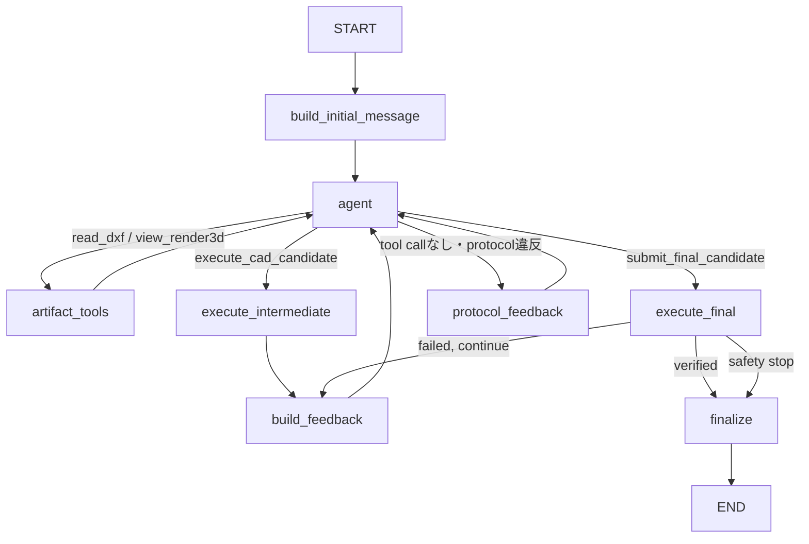

# Zero-shot Pipeline 再実装計画（Final）

## 1. シニアレビュー結論

Claude版の`zeroshot_dep/pipeline/`は、責務別のフォルダ分けには再利用価値がある。一方、今回の第一目的である「実装者自身が内部ロジックを理解し、将来一人で変更できること」に対して、元の実装計画は妥当ではない。

特に、次の点を修正する。

- 巨大な`run_zero_shot.py`を先に多数のファイルへ切り出さない
- CLI agent用sandbox、credential、provider監査をAPI版へ一括移植しない
- DrawingIR、pose推定、仮説fan-outを、動くbaselineより先に実装しない
- LangGraphのgraphだけ先に大きく作り、stub nodeを後から埋める方式を採らない
- 入力、実行、feedback、評価を一度に実装しない
- 推論中の自己検証と、GTを使うオフライン評価を混同しない
- projection IoUや閾値を、十分なcalibrationなしに候補の自動棄却へ使わない
- 比較実験用budgetを、将来の並列agent構成が未定の段階でgraphへ埋め込まない

新実装では、最小のend-to-end経路を最初に完成させ、その後に一機能ずつ追加する。各追加機能は、単体テスト、少数サンプルでの観察、アブレーションの順で評価する。

`zeroshot_dep/`はコピー元や完成形ではなく、次の用途に限定する。

- 入出力contractの確認
- security、CAD実行、監査で考慮すべき失敗例の収集
- DrawingIR、pose、projectionの研究仮説の参照
- 新実装との回帰比較

## 2. 目的と優先順位

優先順位は以下とする。

1. 実装者が各moduleの目的、入出力、失敗条件、テスト方法を説明できる
2. 一サンプルの全message、tool call、artifact、状態遷移を再現・監査できる
3. 評価の誤りやGT leakageがないことを保証する
4. zero-shot 3D CAD復元精度を、測定可能な変更によって改善する
5. 将来、並列agent、Gemini/Claude CLI backend、追加の図面解析を導入できる

精度向上は最終目標だが、「機能を増やしたから改善したはず」とは判断しない。必ず、同一サンプル、同一モデル条件による比較結果を残す。

## 3. 確定した設計要件

### 3.1 Package名

正式名称は次に統一する。

```text
zeroshot/
zeroshot_dep/
```

新実装の内部ロジックは`zeroshot.pipeline`として通常のPython packageにする。ユーザー向けCLIだけは`zeroshot/run_pipeline.py`に置く。`zero-shot`表記、`sys.path`への場当たり的な追加、ハイフン付きpackageのimport workaroundは新実装へ持ち込まない。

実行方法は最終的に次へ統一する。

```bash
python -m zeroshot.run_pipeline ...
```

### 3.2 一サンプルの入力

正式な入力は以下の4点とする。

```text
techdraw/dxf/<id>.dxf
render_3d/hlg_perspective/<id>.png
render_3d/hlg_translucent_faces_perspective/<id>.png
render_3d/transparent_shaded_edges_perspective/<id>.png
```

3枚のPNGは三方向のviewではなく、同じ部品を異なる表現styleで描いた3種類のperspective renderである。

`target/`または`target_step/`は、独立したオフライン評価processだけが読む。推論graph、model、tool、feedback生成processからは到達不能にする。

### 3.3 初回入力のaccess config

```yaml
access_dxf: path                 # path | dxf
access_render3d: image           # none | path | image
access_render3d_styles:
  - hlg_perspective
  - hlg_translucent_faces_perspective
  - transparent_shaded_edges_perspective
```

意味は以下の通り。

- `access_dxf: path`: DXFの論理パスと役割だけを初回user messageに入れる
- `access_dxf: dxf`: DXF textを初回user messageへ直接入れる
- `access_render3d: none`: 初回は3D renderを与えない
- `access_render3d: path`: 選択styleの論理パスとstyle名だけを伝える
- `access_render3d: image`: 選択styleの画像をmultimodal user messageへ添付する

`access_dxf: none`は設けない。DXFはタスク成立に必須である。

### 3.4 次ターンのfeedback config

```yaml
feedback_dxf: dxf               # none | path | dxf
feedback_render3d: image         # none | path | image
feedback_render3d_styles:
  - hlg_perspective
  - hlg_translucent_faces_perspective
  - transparent_shaded_edges_perspective
```

意味は以下の通り。

- `feedback_dxf: none`: 候補から再生成したDXFを返さない
- `feedback_dxf: path`: 再生成DXFの論理パスだけを返す
- `feedback_dxf: dxf`: 再生成DXF textを次のfeedback user messageへ直接入れる
- `feedback_render3d: none`: 候補の3D renderを返さない
- `feedback_render3d: path`: 選択styleの論理パスだけを返す
- `feedback_render3d: image`: 選択styleの画像を次のmultimodal feedback user messageへ添付する

`access_render3d_styles`と`feedback_render3d_styles`は独立させる。初回入力とfeedbackで異なるstyle集合を使えるようにし、別々にアブレーションする。

`feedback_execution`を無効化するconfigは設けない。実行成否、syntax/AST error、timeout、STEP生成、solid数、kernel validityなど、信頼済み実行器が得た結果は必ずmessage historyと監査logへ残す。runが継続する場合は必ず次のmodel turnへ返す。

### 3.5 Modelとbackend

初期対象は以下とする。

- SGLang serverでserveするQwen3.6
- GPT API

LangGraphはworkflowを実行し、実際のmodel API呼び出しはLangChainのchat model integrationが担当する。QwenはSGLangのOpenAI-compatible endpointへ接続し、GPTはOpenAI endpointへ接続する。

workflowはprovider名、base URL、credentialへ依存させない。API版では`model.bind_tools()`が生成したtool-call可能なmodelをagent nodeへ注入する。

将来、Gemini/Claudeを非APIのCLI経路で追加する。その際は、CLI outputをLangGraphが扱う`AIMessage`とtool callへ正規化するadapterを別実装する。CLI固有のcredential、filesystem jail、native tool、provider trace監査を、初期API版へ先回りして入れない。

### 3.6 Agent数とbudget

初期版は単一agentとする。仮説fan-out、候補ごとの並列agent、投票、branch mergeは実装しない。

将来の並列化に備え、初期版から以下のIDを持つ。

- `run_id`
- `sample_id`
- `agent_id`
- `candidate_id`
- 親candidate ID
- tool call ID
- artifact IDと所有candidate

比較実験用の`max_model_turns`、`max_cad_executions`などは初期graphへ固定実装しない。並列構成が決まった後、graphから独立した`BudgetPolicy`として設計する。

ただし、運用上の安全装置として以下は初期版から必要である。

- model API timeout
- CAD実行timeout
- OCC render timeout
- 高めで変更可能なLangGraph再帰安全上限
- 外部からのrun cancellation
- 安全停止理由の監査記録

## 4. Architecture

### 4.1 信頼境界

処理を次の3領域へ分ける。

| 領域 | 役割 | GT access |
|---|---|---|
| Agent workflow | message、tool選択、candidate提出 | 禁止 |
| Trusted reconstruction runtime | code検証、隔離実行、STEP検証、feedback生成 | 禁止 |
| Offline evaluator | 完了した予測STEPとGT STEPの比較 | 許可 |

model生成codeはuntrustedとする。通常のPython processで直接実行せず、timeout可能な隔離processで実行する。

### 4.2 Artifactの扱い

modelへホスト絶対パスを渡さない。サンプルごとの`ArtifactStore`が、次のような論理パスを実体へ解決する。

```text
input/drawing.dxf
input/render3d/hlg_perspective.png
candidate/<candidate_id>/model.py
candidate/<candidate_id>/output.step
candidate/<candidate_id>/feedback/drawing.dxf
candidate/<candidate_id>/feedback/render3d/<style>.png
```

`ArtifactStore`は以下を保証する。

- `..`、絶対パス、symlink escapeを拒否する
- 現在のsample以外のartifactを参照させない
- `target/`、`target_step/`を登録しない
- candidate codeと実行結果をimmutableに保存する
- content hash、生成元、作成時刻、media typeをmanifestへ記録する

### 4.3 依存方向

依存は次の一方向にする。

```text
run_pipeline
  -> workflow
       -> models
       -> tools
            -> artifacts
            -> execution
            -> feedback
                 -> src.data.render
  -> audit

offline evaluation
  -> src.evaluation
  -> src.metrics
```

`workflow`から`zeroshot/run_zero_shot.py`または`zeroshot_dep`をimportしない。

## 5. 目標フォルダ構成

最初から空ファイルをすべて作らず、後述のphaseで必要になった時点で追加する。

```text
zeroshot/
├── __init__.py
├── run_zero_shot.py                 # 既存CLI baseline。再実装中は変更しない
├── run_pipeline.py                  # 新pipelineの薄いCLI
├── pipeline/
│   ├── __init__.py
│   ├── config.py                    # config schemaとvalidation
│   ├── inputs.py                    # sample discoveryとInputManifest
│   ├── artifacts.py                 # logical path、manifest、immutable保存
│   ├── messages.py                  # access/feedback message builder
│   ├── runner.py                    # 後続: application wiringとsample loop
│   ├── models/
│   │   ├── __init__.py
│   │   ├── base.py                  # normalized AgentModel protocol
│   │   ├── api.py                   # GPT / SGLang OpenAI-compatible
│   │   └── cli.py                   # 後続: Gemini / Claude CLI
│   ├── tools/
│   │   ├── __init__.py
│   │   ├── read_dxf.py
│   │   ├── view_render3d.py
│   │   ├── execute_candidate.py
│   │   └── submit_final.py
│   ├── execution/
│   │   ├── __init__.py
│   │   ├── validate_code.py
│   │   ├── run_code.py
│   │   └── verify_step.py
│   ├── feedback/
│   │   ├── __init__.py
│   │   ├── render.py
│   │   └── build_message.py
│   ├── workflow/
│   │   ├── __init__.py
│   │   ├── state.py
│   │   ├── agent.py
│   │   ├── routing.py
│   │   └── graph.py
│   ├── audit/
│   │   ├── __init__.py
│   │   ├── events.py
│   │   └── writer.py
│   ├── evaluation/
│   │   ├── __init__.py
│   │   └── score_run.py
│   ├── drawing/                     # 後続TODO
│   │   ├── schema.py
│   │   ├── extract.py
│   │   ├── summary.py
│   │   └── pose.py
└── configs/
    └── default.yaml

tests/
└── zeroshot/
    └── pipeline/
        ├── fixtures/
        ├── test_config.py
        ├── test_inputs.py
        ├── test_artifacts.py
        ├── test_messages.py
        ├── test_execution.py
        ├── test_tools.py
        ├── test_graph.py
        ├── test_feedback.py
        └── test_leakage.py
```

`run_pipeline.py`は引数解析と内部pipelineの呼び出しだけを担当し、sample loopやworkflow構築を置かない。Phase 1では`pipeline/`直下の`config.py`、`inputs.py`、`artifacts.py`、`messages.py`だけを追加する。`runner.py`を含む後続ファイルは必要になるphaseまで作らない。

ファイルが大きくなってから責務に沿って分割する。最初から`constants.py`、`provider.py`、`credentials.py`などを機械的に量産しない。

## 6. LangGraph Agent設計

### 6.1 State

`messages`にはLangGraphの`add_messages` reducerを使う。それ以外は単一agentが一箇所ずつ更新し、未使用の並列reducerを先回りして入れない。

概念上のstateは以下とする。

```python
class ReconstructionState(TypedDict, total=False):
    messages: Annotated[list[BaseMessage], add_messages]

    run_id: str
    sample_id: str
    agent_id: str

    access_config: dict
    feedback_config: dict

    candidate_ids: list[str]
    active_candidate_id: str | None
    final_candidate_id: str | None
    last_execution: dict | None

    artifact_manifest_path: str
    audit_path: str
    status: str
    safety_stop_reason: str | None
```

巨大なDXF text、画像bytes、candidate code、render画像をstateへ直接蓄積しない。stateにはartifact IDまたは論理パスを保持する。

### 6.2 bindするtool

初期agentへ次の4toolを公開する。

1. `read_dxf_artifact(logical_path)`
2. `view_render3d_artifact(logical_path)`
3. `execute_cad_candidate(code, cad_format)`
4. `submit_final_candidate(code, cad_format)`

`read_dxf_artifact`と`view_render3d_artifact`は分ける。textとimageでは返却形式、size制約、provider互換性、監査項目が異なるためである。

`execute_cad_candidate`はmodelが自発的に呼ぶ中間検証toolである。tool protocolを閉じる`ToolMessage`を追加した後、実行結果と設定されたfeedbackを次のuser messageとして組み立て、model turnへ返す。

`submit_final_candidate`は実行toolではない。「このcodeを最終候補とする」という構造化された宣言である。通常のAIMessage本文やMarkdown code blockを最終codeとして暗黙抽出しない。

### 6.3 中間実行と最終実行

CAD実行には次の2経路を両方持つ。

1. modelが`execute_cad_candidate`を自発的に呼ぶ
2. modelが`submit_final_candidate`を呼んだ後、workflowが同じtrusted executorを必ず呼ぶ

最終候補は、中間実行済みで同じcode hashだったとしても再実行する。監査eventには呼び出し元を`model`または`workflow`として記録する。

`submit_final_candidate`は一つのAIMessage内で他toolと混在させない。複数の読み取りtoolは許可してよいが、実行や最終提出のような副作用を持つtoolは一度に一つだけ処理する。

最終実行結果は対応する`ToolMessage`としてmessage historyへ追加する。runを継続する場合、`build_feedback` nodeが`feedback_execution`と設定されたDXF/renderを含む`HumanMessage`を続けて追加してからagentへ戻す。

- 成功: verified STEPをfinal artifactに昇格し、そのmodelを再呼び出さず終了する
- 失敗: safety stopでなければexecution feedbackを返してagentへ戻す
- safety stop: 未検証成果物を成功扱いせず、理由を保存して終了する

### 6.4 Graph topology

`create_react_agent`で隠蔽せず、学習のため`StateGraph`、`ToolNode`、conditional edgeを明示的に組み立てる。



tool callを生成するかはmodelが決める。tool callの引数検証、実行、次nodeへのroutingはworkflowが決める。

### 6.5 Image tool resultの互換性

初回の`image` modeは通常のmultimodal user messageとして送る。

`view_render3d_artifact`では、tool call IDに対応する`ToolMessage`を必ず作る。その上で画像content blockを同じToolMessageで扱えるか、GPT backendとSGLang/Qwen backendのlive capability testを行う。

両backendで同じ形式が使えない場合は、全backendで次へ統一する。

1. `ToolMessage`でartifact ID、style、読取成功を返す
2. 続くuser messageへ画像を添付する

providerごとに異なる会話意味論を使うのではなく、両者がサポートする共通形式を採用する。

`feedback_render3d: image`は実行toolそのものの返却値へ混ぜず、対応する`ToolMessage`の後に`build_feedback` nodeが作るmultimodal user messageへ添付する。これにより、tool protocolと「feedbackを次のuser instructionで返す」という実験条件を分離する。

## 7. 監査設計

LangGraphを採用する主目的の一つは、agentの外部から観測可能な行動を監査することである。

各runで少なくとも次を保存する。

- run/sample/agent/candidate ID
- graph nodeと遷移元・遷移先
- provider、model、base URL識別子、sampling parameter
- access/feedback configとeffective style
- system/user/tool messageの再現に必要なpayloadまたはartifact参照
- prompt template versionとrendered prompt hash
- tool名、検証済み引数、tool call ID
- toolの呼び出し元`model | workflow`
- 開始・終了時刻、duration、status、短いerror
- candidate code hash
- execution、STEP verification、render結果
- token usageなどproviderが返すusage
- safety stopとinfra error

監査対象はmessage、tool call、tool result、artifact、状態遷移である。非公開chain-of-thoughtの生成や保存を要求しない。

LangGraphのcheckpointerだけを唯一の研究記録にしない。人間が読みやすくversionに依存しにくい`events.jsonl`と`artifact_manifest.json`をcanonical recordにする。checkpointerはresumeやdebugの補助として扱う。

credential、API key、authorization headerは保存しない。base URLにsecret queryが含まれる場合もredactする。

## 8. 実装フェーズ

各phaseは前のphaseの成果を実際に読み、テストし、説明できてから進む。

### ✅ Phase 0: datasetと既存評価器の基準線を確認する

#### 確認するもの

- 新package名を`zeroshot`に確定する
- `data/test_vlm/test_vlm.csv`に記載された20件すべてを、固定debug兼regression sampleとする
- 既存testにある手書きDXF、画像、CadQuery code、STEP fixtureを再利用できることを確認する
- `src.evaluation`、`src.metrics`、solid検査の既存testを実行し、評価基準線とする

詳細contractは全体像が見えない段階で一括固定しない。各phaseの実装直前に、そのphaseが必要とする最小の入出力だけをtestと型で確定する。`zeroshot/run_zero_shot.py`と`zeroshot_dep`は、その時点で必要な振る舞いを調べる参照資料とし、先にcontractを転記しない。

API agent用dependencyのversion固定もこのphaseでは行わない。GPTとQwen/SGLangの最初のlive vertical sliceが動いたPhase 4で、実際に検証できた組合せを記録する。

#### 評価器のsanity check

- GT STEPを自身と比較した場合に高得点になる
- missing predictionは成功率の分母から消えず、失敗として数えられる
- invalid STEP、multi-solid、timeoutがrun全体を落とさない
- 明らかに異なる形状または変形形状でscoreが低下する
- shape-normalized metricとunnormalized metricを混同しない

#### 理解チェック

次を自分の言葉で説明できること。

- 推論中のfeedbackとGT評価の違い
- なぜ図面から絶対scaleが復元できない場合があるか
- なぜOCC処理をchild processへ隔離するか

#### 完了条件

modelもLangGraphも呼ばず、20件の入力集合が揃っていることと、既存fixtureに対する評価器の正否を確認できる。

#### 完了記録

2026-07-27に`drawing2cad` conda environmentで、次の既存testを実行した。

- `tests/evaluation/test_evaluator.py`
- `tests/evaluation/test_scoring.py`
- `tests/metrics/test_eccv.py`
- `tests/metrics/test_geometry.py`
- `tests/data/audit/test_solid_checks.py`

結果は39 test passed、40 subtests passed。`data/test_vlm`は20 IDすべてについてDXF、3種類のrender、GT STEPのID集合が一致したため、Phase 0を完了とする。

### Phase 1: Config、入力、ArtifactStore、message builder

#### 実装するもの

- `config.py`
- `inputs.py`
- `artifacts.py`
- `messages.py`
- 対応するunit test

#### 順序

1. `InputManifest`で4入力の存在、拡張子、重複、symlinkを検証する
2. `ArtifactStore`で論理パスを解決する
3. access configだけで初回messageを構築する
4. feedback configを使うmessage builderのinterfaceだけ作る
5. 全config組合せをtable-driven testにする

#### 必須test

- `none`のmodalityがpromptにもpayloadにも現れない
- `path`では論理パスとstyle名だけが現れる
- `dxf`では正しいDXF textがdelimiter付きで入る
- `image`では選択された画像だけが宣言順に添付される
- access styleとfeedback styleが混ざらない
- 未知styleと重複styleを拒否する
- targetのpathをArtifactStoreで解決できない
- host絶対パスがmodel-facing messageに現れない

#### 完了条件

modelとCADを使わず、全message payloadをtestで目視・比較できる。

### Phase 2: Trusted CAD execution

#### 最初の対象

まずCadQueryだけでvertical sliceを完成させる。`cad_format`をcontractには含めるが、build123d対応はCadQuery executorの理解とtest完了後に同じinterfaceへ追加する。

#### 実装するもの

- AST/source validation
- candidate IDとimmutable source保存
- kill可能な隔離subprocess
- `output.step`生成contract
- STEP再読込
- solid数とkernel validityの検証
- execution report

#### 重要方針

- model codeをpipeline process内で`exec`しない
- 入力DXF、画像、GT、repositoryを実行sandboxへ渡さない
- timeout時はterminate後、必要ならkillする
- validation失敗とinfra failureを区別する
- 既存runnerのsecurity testを、コードではなくfixture/期待結果として参照する

#### 必須test

- valid single box
- syntax error
- denied import
- filesystem探索またはnetwork/subprocess使用
- STEP未生成
- zero solid / multi-solid
- invalid STEP
- infinite loop timeout
- 同じcandidate fileの上書き拒否

#### 完了条件

固定code fixtureだけを用い、安全に`ExecutionReport`とverified STEPを生成できる。

### Phase 3: Fake modelによるLangGraph vertical slice

#### 実装するもの

- `workflow/state.py`
- 4tool
- `workflow/agent.py`
- `workflow/routing.py`
- `workflow/graph.py`
- 最小監査writer
- scripted fake chat model

#### 作る順序

1. fake modelが`read_dxf_artifact`を呼ぶ
2. fake modelが`execute_cad_candidate`を呼ぶ
3. execution feedbackを受けてcodeを修正する
4. fake modelが`submit_final_candidate`を呼ぶ
5. workflowが強制最終実行する
6. verified STEPと監査logを保存する

このphaseでは`feedback_dxf: none`、`feedback_render3d: none`とし、execution feedbackだけでloopを完成させる。

#### 必須test

- tool call IDとToolMessage IDが一致する
- model主導実行後に必ずagentへ戻る
- 最終提出後にworkflowが再実行する
- 最終提出と他toolの混在を拒否する
- toolなしresponseを最終成果物として採用しない
- 最終実行失敗後にfeedbackを返す
- safety stopで未検証STEPを成功扱いしない
- graph図が設計図と一致する
- eventsを順番に再生するとrunを説明できる

#### 完了条件

外部APIなしで、入力からverified STEPまで一周する。

### Phase 4: GPT APIとQwen/SGLangを接続する

#### 実装するもの

- normalized `AgentModel` boundary
- GPT model factory
- SGLang OpenAI-compatible model factory
- credential redaction
- backend capability smoke test
- one-sample live CLI

SGLang serverはpipelineと別process、可能なら別environmentで起動する。pipeline側は`base_url`、`model`、認証情報だけを受け取り、`sglang[all]`へ直接依存しない。

#### capability test

各backendで以下を実測する。

- `bind_tools()`したschemaを認識する
- structured tool argumentsを返す
- 複数のread-only tool callを扱える
- multimodal initial user messageを扱える
- imageを含むtool resultの共通形式を扱える
- token usage、finish reason、tool call IDを取得できる

#### live smoke test

最初は1 sample、1 model、CadQuery、execution feedbackのみで実行する。成功率を論じる段階ではなく、messageとstate遷移を一行ずつ追う。

#### 完了条件

GPTとQwenの双方で、少なくともtool read、任意実行、最終提出、強制実行のprotocolが同じgraph上で動く。

このlive smoke testで動作したagent側とSGLang server側のdependency versionをそれぞれ記録し、以後の再現可能な基準とする。

### Phase 5: DXFと3D render feedback

#### 実装順

1. verified STEPから再投影DXFを生成する
2. `feedback_dxf: path`
3. `feedback_dxf: dxf`
4. 候補の3D renderを生成する
5. `feedback_render3d: path`
6. `feedback_render3d: image`
7. style選択と組合せtest

renderer本体は再実装せず、以下をtrusted child processから呼ぶ。

- `src.data.render.techdraw.generate_techdraw`
- `src.data.render.render3d.generate_render3d`
- `src.data.render.config`のpath/style contract

これらの関数は同期処理なので、pipeline側でkill可能なprocessとtimeoutを提供する。

実行に失敗してSTEPが存在しない場合、DXF/render feedbackを無理に生成しない。execution feedbackだけを返す。renderだけ失敗した場合は、execution成功とrender failureを別々に報告する。

初期版では、再投影DXFの自動IoU閾値による候補棄却を行わない。まずartifactをmodelへ返し、精度向上効果を測る。数値projection checkは後続の独立機能とする。

#### 必須test

- feedback `none`で該当rendererを呼ばない
- `path`で内容を自動注入しない
- `dxf`で候補自身のDXFだけを入れる
- `image`で選択styleだけを添付する
- input画像とcandidate画像を取り違えない
- renderer timeoutをexecution failureと混同しない
- feedback artifactがcandidate directory外へ出ない

#### 完了条件

accessとfeedbackの全modeが、fake modelと両live backendで意図したmessageになる。

### Phase 6: 評価と段階的アブレーション

#### 推論と評価の分離

推論runを完了・closeした後、別CLIでGT評価する。

```bash
python -m zeroshot.pipeline.evaluation.score_run \
  --run-dir <run_dir> \
  --target-dir <target_dir>
```

evaluatorは`src.evaluation.scoring`と`src.metrics`をimportして使い、metric実装をコピーしない。

#### 最初に報告する指標

- prediction coverage
- code execution success
- valid single-solid率
- normalized Voxel IoU
- normalized ECCV surface/edge/vertex/topology F1
- BoundingBox error
- unnormalized metricは参考値として別欄
- model call数、token、CAD実行数、wall time

自己feedbackで使う再投影DXFやrenderは、GT metricではない。自己整合性が高くても正しい3D形状とは限らないため、別欄に分ける。

#### データ運用

- debug set: 実装確認用の少数固定ID
- locked evaluation set: promptや閾値調整に使わない固定ID
- failed/missing predictionを集計から落とさない
- infra errorとmodel reconstruction failureを分ける
- sample ID list、model、sampling、config、code versionをrun manifestへ保存する

#### アブレーション順

全configの直積を最初から回さない。次の順で原因を分離する。

1. access modality: DXF `path/dxf`、render `none/path/image`
2. access render style
3. DXF feedback `none/path/dxf`
4. render feedback `none/path/image`
5. feedback render style
6. DrawingIRなし/あり

比較は可能な限り同一sampleのpaired resultで行う。小規模runでは平均値だけで結論を出さず、sample別の改善・悪化とfailure classを読む。

#### 完了条件

少なくとも一つの変更について、「どのsampleで、どのmetricが、どのcost増加とともに変化したか」を説明できる。

### Phase 7: DrawingIRを理解してから追加する

DrawingIRは削除対象ではなく、重要な将来の精度改善候補である。ただし既存codeを一括コピーしない。

#### `drawing/extract.py`

確認する内容:

- DXF entity typeとanalytic geometryへの変換
- layerからのfront/top/right view割当
- hidden linetype解決
- loop抽出
- view間correspondence
- degenerate entityの扱い

小さなDXF fixtureを一種類ずつ追加し、期待するIRを手で確認する。

#### `drawing/summary.py`

確認する内容:

- 何をpromptへ残し、何を省略するか
- hidden lineが存在しない図面の表現
- truncationによって重要featureが落ちないか
- 同じIRから常に同じsummaryを作れるか

golden testでsummary全文をreview可能にする。

#### `drawing/pose.py`

確認する内容:

- front/top/rightとworld axisの対応
- right-handed mapping
- 対称形状や同一extent軸による複数解
- scale/translation/rotationの責務
- 最初のmappingを無条件採用しないこと

cube、直方体、軸対称形状、非対称形状をfixtureにする。

#### 導入方法

```yaml
use_drawing_ir: false
```

で無効化可能にする。生DXF baselineと同一条件で比較し、次のどちらかを説明できた場合のみ標準化を検討する。

- GT metricを改善する
- failure解析を明確に改善する

単体testが通るだけでは標準有効化しない。

### Phase 8: 後続拡張

#### Gemini/Claude CLI backend

- normalized `AgentModel` contractへ接続する
- CLIのnative toolを使わせるか、LangGraph toolだけに制限するかを実測して決める
- native toolを使う場合はprovider traceをLangGraph auditへ正規化する
- credential stagingとjailはbackend内部へ閉じ込める
- `run_zero_shot.py`の実装を丸ごと再利用せず、必要なsecurity contractとtestだけを抽出する

#### 並列agent

- 単一agent loopをsubgraph化する
- candidateごとに独立artifact namespaceを持つ
- merge policyと最終選択基準を明示する
- その段階でrun-level `BudgetPolicy`を設計する

#### 数値projection feedback

- identical STEP再投影によるrenderer ceiling
- wrong-shape negative control
- hidden lineなしview
- missing/degenerate view
- per-view scoreとaggregate score
- thresholdによるfalse reject

をcalibrateしてから追加する。単一のmean IoUだけで候補を捨てない。

## 9. 出力contract

```text
<out_dir>/
├── run_manifest.json
├── run_summary.json
└── <sample_id>/
    ├── result.json
    ├── events.jsonl
    ├── artifact_manifest.json
    ├── messages.jsonl
    ├── candidates/
    │   └── <candidate_id>/
    │       ├── model.py
    │       ├── execution.json
    │       ├── execution.log
    │       ├── output.step
    │       └── feedback/
    │           ├── drawing.dxf
    │           └── render3d/
    └── final/
        ├── model.py
        └── output.step
```

`final/`へ昇格できるのは、workflow主導の最終実行でsingle valid solidを確認したcandidateだけとする。失敗runにroot-levelの信頼済みSTEPがあるように見せない。

## 10. Test方針

### Unit test

- config validation
- logical path resolution
- message builderの全mode
- tool schemaと引数validation
- routing
- audit event serialization
- execution report / feedback report

### Integration test

- fake modelによる完全なagent loop
- real CadQuery boxの隔離実行
- STEPからDXF/render生成
- scorerによるGT self-checkとinvalid prediction

### Security / leakage test

- target path拒否
- symlink escape拒否
- model codeからinput/repository/GTを読めない
- network/subprocess/他CAD kernelの拒否
- credentialがlog/artifactへ残らない

### Live test

GPT/Qwenのlive testは通常のunit testから分離し、明示的markerまたはCLIでだけ実行する。API quotaやservice outageをmodel精度失敗として数えない。

基本commandは次とする。

```bash
python -m pytest -q tests/zeroshot/pipeline
ruff check zeroshot tests/zeroshot/pipeline
python -m zeroshot.run_pipeline --help
```

## 11. 既知のriskと回帰確認

`zeroshot_dep`から研究機能を参照する場合、少なくとも以下を先にfixture化する。

- hidden lineが0本でも正常な図面
- BYLAYER linetype解決
- 同じextentを持つ軸が複数あるpose
- left/rightまたはfront/backが曖昧な形状
- missing viewとdegenerate view
- renderer outputがartifact root外を指さないこと
- diff画像pathと実ファイルの一致
- empty hidden maskをIoU失敗として扱わないこと
- mean scoreが一つの悪いviewを隠さないこと

また、DXF textがcontextを圧迫する可能性、provider間でimage tool result仕様が異なる可能性、OCCがnative hang/crashする可能性をrun manifestとfailure taxonomyへ反映する。

## 12. 実装順の要約

```text
Phase 0  評価器・contract・fixture
   ↓
Phase 1  config・input・artifact・message
   ↓
Phase 2  trusted CAD execution
   ↓
Phase 3  fake model LangGraph vertical slice
   ↓
Phase 4  GPT / Qwen API
   ↓
Phase 5  DXF / render feedback
   ↓
Phase 6  評価・アブレーション
   ↓
Phase 7  DrawingIR
   ↓
Phase 8  CLI backend・並列agent・数値projection
```

最初の実装着手点はPhase 0であり、フォルダを一括作成することではない。各phaseの完了時に、実装者がcode walkthroughを行い、次のphaseへ進む前に「何が動き、何がまだ動かないか」をREADMEへ追記する。

## 13. Finalize状態

設計上のopen questionは現時点で残していない。実装中に新しい事実が判明した場合は、既存の決定を暗黙に変更せず、短いADRまたは本計画の変更履歴として理由と影響範囲を記録する。
